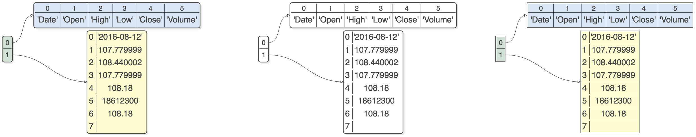
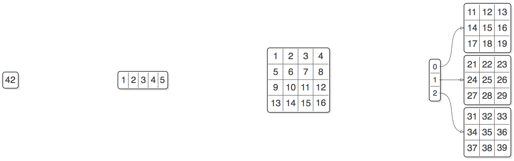
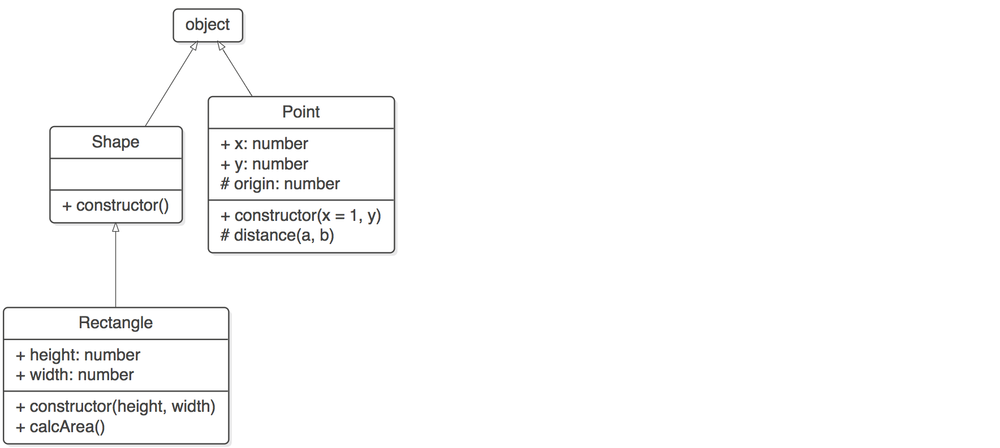

```
 ╭○──╮  ╭──────╮  ╭○──╮  ╭───╮╭─╮  ╭───╮  ╭──────╮                 ╭───╮  ╭──────╮
 │   │  │  `╭╮ │  │   │  │   ││ │  ├─○─┤  ├────  │  ╭─────────────▷│   │  │ `○───┤
 │   │  │   ││ │  │   │  │   ╰╯ │  │   │  │      ┼──╯             ╭╯   │  │      │
 │   │  │   ╰╯ │  │   │  ╰╮    ╭╯  │   │  │ `○───┼╮      ╭○──╮    │    │  ├────  │
 ╰───╯  ╰─○────╯  ╰───╯   ╰───○╯   ╰───╯  ╰──────╯╰─────▷│   │    ╰─○──╯  ╰──────╯
                                                         ╰───╯
```
> A small set of functions that display simple data structures and arbitrary object graphs including lists, dictionaries, linked-lists, binary trees, class hierarchies and function call stacks (not implemented) in a reasonable manner using [viz.js](https://github.com/mdaines/viz.js/) (graphviz for the web). A Javascript data-structure visualization tool, ported from https://github.com/parrt/lolviz

For more information please check the [original project page](https://github.com/parrt/lolviz)

[](https://websemantics.github.io/lolviz.js/editor.html)
[](https://websemantics.github.io/lolviz.js)

Also, see [examples](https://websemantics.github.io/lolviz.js/assets/demo/examples.html)

## Assumptions

This implementation makes the assumption that Javascript `Map` and `Set` types are sufficient replacement for Python `dict` and `tuple` types respectively.

Mapping of data types between Javascript and Python is tricky (huh, who knew!) and it's likely that there're better ways to do that. Feel free to send comments and suggestions for how to improve.

Also, here's a quick reminder of few Python collections (arrays) that have been used in lolviz,

* `List`       : Ordered and changeable collection (Allows duplicate)
* `Tuple`      : Ordered and unchangeable collection (Allows duplicate)
* `Set`        : Unordered and unindexed collection (No duplicates)
* `Dictionary` : Unordered, changeable and indexed collection (No duplicates)

## Appearance

There was an attempt in this project to make few style changes to graphviz generated SVG images in order to enhance their apperance.

Here's an example of the three styles that can be displayed (fancy, b&w and classic),



This was achieved by making few tweaks to the original code to accumodate run-time changes to color and style (line thickness for example) in addition to making direct changes to the SVG DOM of the generated images.

Also, check out [this reference page](https://websemantics.github.io/lolviz.js/assets/demo/graphviz.html) for more examples of how to write/tweak graphviz dot graphs.

## New Features

Addmitedly, what comes next is not exactly inline with the initial premise of the lolviz library but they were included in this project regadless because, 1. They can be useful tools, 2. They produce cool visualizations, and 3. why not?

#### Tensors

This feature visualizes Tensors with different sizes/ranks like scalars, vectors, matrices or any rank `n` tensors (up to rank 3 for the timebeing).



Check out this [example](https://websemantics.github.io/lolviz.js/assets/demo/tensor.html)

#### Class Hierarchy

This feature is useful when you have a collection of related objects and want to visualize their internal structure and the class hierarchy that ties them together.



Check out this [example](https://websemantics.github.io/lolviz.js/assets/demo/reflect.html)

## Libraries

Included in this project the following support libraries,

#### Python.js

Approximal implementations of some of [Python built-in functions](https://docs.python.org/2/library/functions.html) and a few extra helpers.

* `id`         : Generate an id
* `escape`     : Escape HTML entities
* `stringify`  : Enhanced JSON.stringify function
* `repr`       : Get a printable representation of an object
* `str`        : Get a nicely printable representation of an object
* `hasattr`    : Check if an object’s contains a specific attribute
* `isinstance` : Check if an object is an instance of provided type
* `list`       : Convert a `Set`, `Map` or an object instance to an array of keys
* `ord`        : Get the char code of the first character of a string
* `chr`        : Get the character of a char code
* `array`      : Get an empty array for the given size
* `range`      : Iterate over the given range (from, to)
* `flat`       : A variant of 'str' function
* `chunk`      : Split an array into chunks
* `len`        : Get variable size (set, map, array or object)

#### Type.js

A tiny libary to work with Javascript types including a built-in support for ducktyping.

* `type` : Return variable type as a string
* `is`   : Check for a variable type
* `as`   : Check for a variable ducktype
* `ctor` : Get a variable class name

#### Reflect.js

Inspect objects for their internal structure including,

* Class name and class hierarchy (parent classes)
* Member properties and their data types (static and public)
* Member methods, their arguments (static and public)
* Arguments data types and default values if any.

#### SVG.js

SVG helper library to create/manipulate SVG DOM elements.

#### Fancy.js

Custom DOM-Stylier for the SVG images generated by Viz.js.

#### Highlight.js

Super tiny generic code highlighter for the demo page.

## Support

Need help or have a question? post a questions at [StackOverflow](https://stackoverflow.com/questions/tagged/lolviz.js)

*Please don't use the issue trackers for support/questions.*

## Contribution

Not sure if I'll continue to develop this library but I'm more than happy to accept external contributions to the project in the form of pull requests :)

## License

[MIT license](http://opensource.org/licenses/mit-license.php)
Copyright (c) Web Semantics, Inc.

