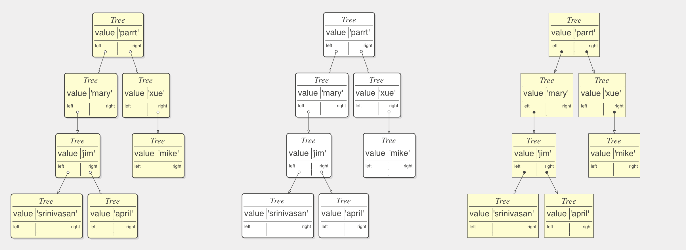

```
 ╭───╮  ╭──▞───╮  ╭───╮  ╭───╮╭─╮  ╭───╮  ╭──────╮         ╭───╮  ╭──────╮
 │   │  │   ╭╮ │  │   │  │   ││ │  ├───┤  ├────  │         │   │  │  ────┤
 │   │  │   ││ │  │   │  │   ╰╯ │  │   │  │      │        ╭╯   │  │      │
 │   │  │   ╰╯ │  │   │  ╰╮    ╭╯  │   │  │  ────┤  ╭──╮  │    │  ├────  │
 ╰───╯  ╰──────╯  ╰───╯   ╰────╯   ╰───╯  ╰──────╯  ╰──╯  ╰────╯  ╰──────╯
```

> A small set of functions that display simple data structures and arbitrary object graphs including lists, dictionaries, linked-lists, binary trees and function call stacks (not implemented) in a reasonable manner using [viz.js](https://github.com/mdaines/viz.js/) (graphviz for the web). A Javascript data-structure visualization tool, ported from https://github.com/parrt/lolviz

For more information please check the [original project page](https://github.com/parrt/lolviz)

[](https://websemantics.github.io/lolviz.js)

Also, see [examples](https://websemantics.github.io/lolviz.js/examples.html)

## Python Collections

Quick reminder of few Python collections (arrays) mainly for myself,

* List       : Ordered and changeable collection (Allows duplicate)
* Tuple      : Ordered and unchangeable collection (Allows duplicate)
* Set        : Unordered and unindexed collection (No duplicates)
* Dictionary : Unordered, changeable and indexed collection (No duplicates)

#### Note:

This implementation makes the assumption that Javascript `Map` and `Set` types are sufficient replacement for Python `dict` and `tuple` types respectively.

## Tensors

This implementation includes an implementation to visualize Tensors (Scalar, Vector, Matrix etc).

## Appearance

I've made an attempt in this project to make few style changes to graphviz generated SVG images to enhance the visualization apperance.

This was achieved by making few tweaks to the original code to accumodate changes to color and style (line thickness for example) in addition to making direct changes to the SVG DOM of the generated images.

Here's an example of the three styles that can be achived (fancy, b&w and classic),



## Support

Need help or have a question? post a questions at [StackOverflow](https://stackoverflow.com/questions/tagged/lolviz.js)

*Please don't use the issue trackers for support/questions.*

## Contribution

Not sure if I'll continue to develop this library but I'm more than happy to accept external contributions to the project in the form of pull requests :)

## License

[MIT license](http://opensource.org/licenses/mit-license.php)
Copyright (c) Web Semantics, Inc.

